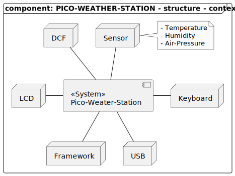

# Content

# Brief
This project realizes a simple weather-station to be usable on a Raspberry Pico Pico MCU.

# Features
- provide ambient temperature information
- provide ambient humidity information
- display information on a LCD
- provide maximum and minimum values of temperatur and humidity of the last 24 hours
- support for an keypad

# Context

| Node      | Description |
|-----------|-------------|
| DCF       |             |
| Sensor    | Different sensor to measure current ambient status. E.g. temperature, humidity, air-pressure |
| LCD       | Display to show current status of ambient sensors. |
| Keyboard  | A simple keypad to control the weather-station. Including changing inforamtion thats currently shown on the LCD . |
| Framework | Set of SW-modules to realize logic-functions and to control external HW-components |
| USB       | The system includes the possibility to connect an external computer to exchange data. |