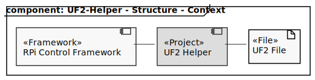

# UF2 Helper

#### Location

[Projects](../README.md) / UF2-Helper

#### Navigation

[Features](#features) | [Context](#context) | [Usage](#usage) | [Changelog](#changelog)

## Brief
[[TOP](#location)]

This program can parse and print information of an given uf2 file.
The program is used via the command line.

## Features
[[TOP](#location)]

- Parse uf2 file
- Display inforamtion of all blocks of the given uf2 file
- print a hexdump of each uf2-block of the given file
- checks for invalid uf2-block definitions while parse and displays them

## Context
[[TOP](#location)]



| Node      | Description                                                                         |
|-----------|-------------------------------------------------------------------------------------|
| Framework | This program uses the [rpi-control-framework](https://github.com/smuuze/rpi_control_frmwrk) for basic functionality             |
| UF2 File  | The file to be parsed as a uf2 formated program file. Is given via the command line |

## Usage
[[TOP](#location)]

The program is used on the command line. Call it with the help argument to get a list of available arguemnts
and its parameters.

```Bash
./uf2Helper -help
```

## Changelog
[[TOP](#location)]

### Version 1.0

- Date: 2022 / 12 / 31
- Author: Sebastian Lesse

#### New Features

- Read and parse uf2 files and print out block information

#### Bug Fixes

- none

#### Misc

- none

#### Known Bugs

- none